# TP1- Library management

## description
This first homework consists of designing a program to manage
a library:
* Client: add, modify, show, search and delete
* Book: add, modify, show
* Borrowing: take and return a book, and show the list of borrowed books

|   Information  |
| ------------- | ------------- |
| Programming language  | DBase 3+  |
| Language  | French  |
| Project Start  | Friday, December 30th, 2005  |
| Project End  | Friday, January 6th, 2006  |

## How to?
* Install Winows XP on a virtual machine
* Install DBase 3+
* In DBase binary folder, copy "tp_si"
* Open a command shell there
* Type this command:
```
dbase tp_si\karime
```

## Screenshots

### The main window
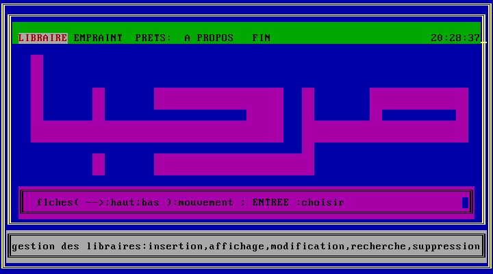

### Client management

Client management menu


Client insertion
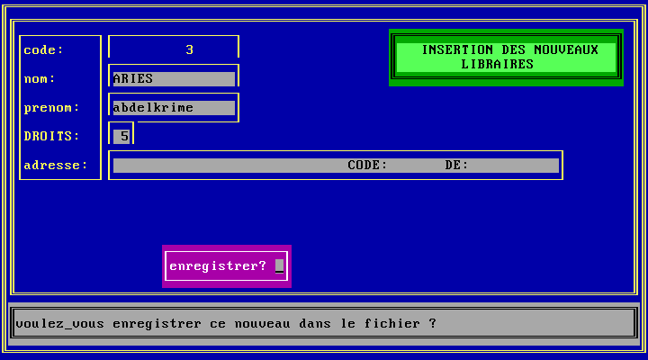

Client show
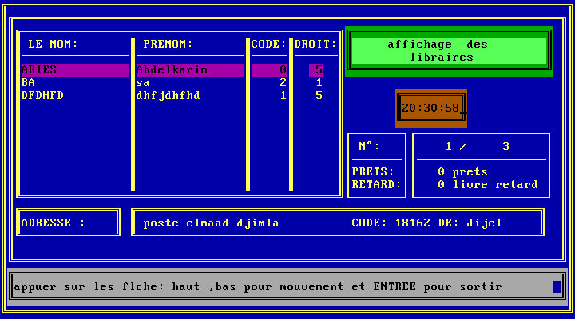

Client search
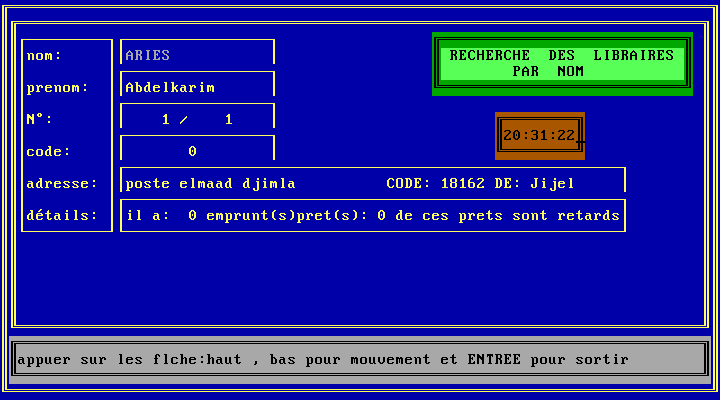

### Books management

Books management menu


Books insertion
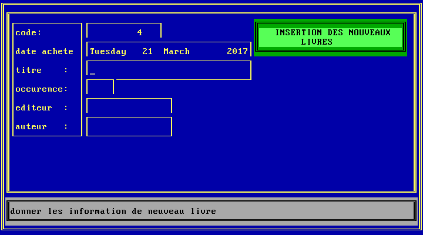

Books show
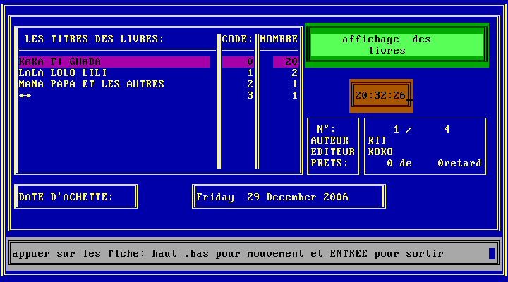

### Borrowing management

Borrowing menu
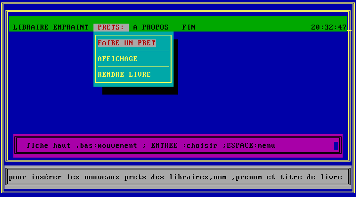

Borrowing a book
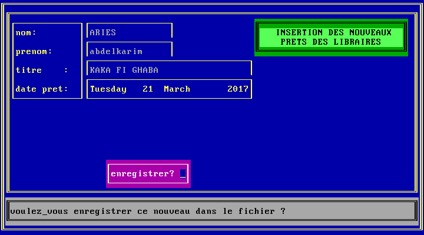

Returning a book
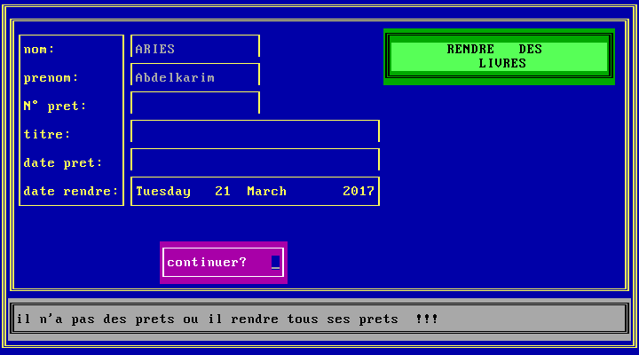

### About and Close

About
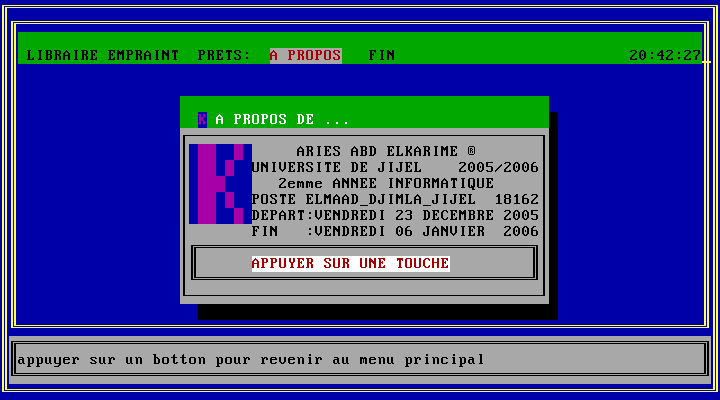

Close
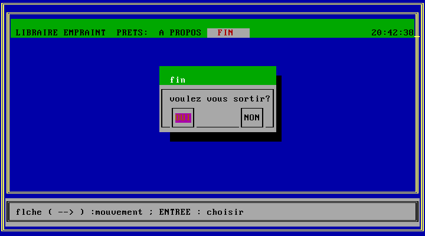
