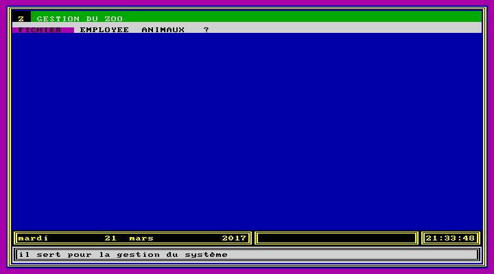
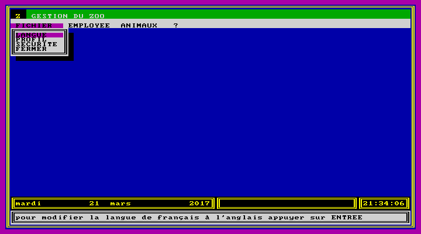
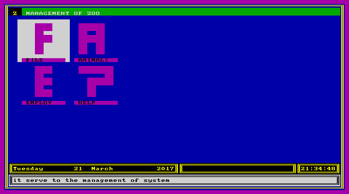
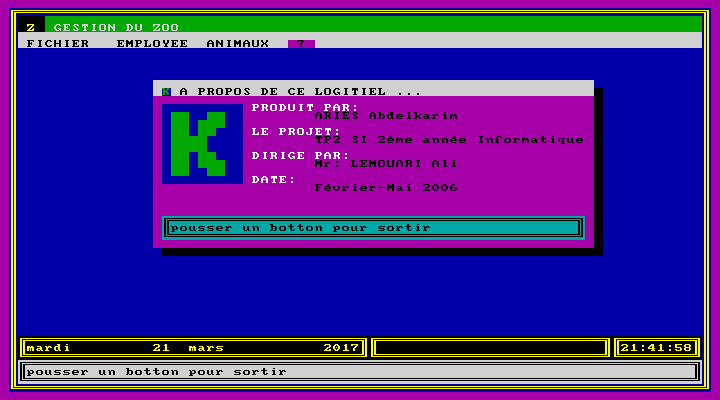
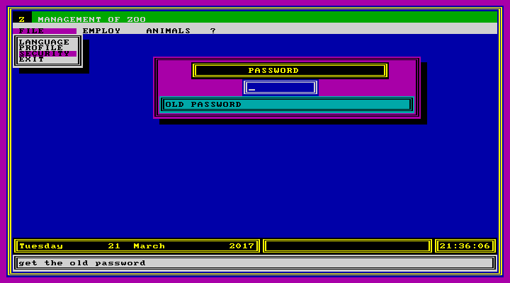
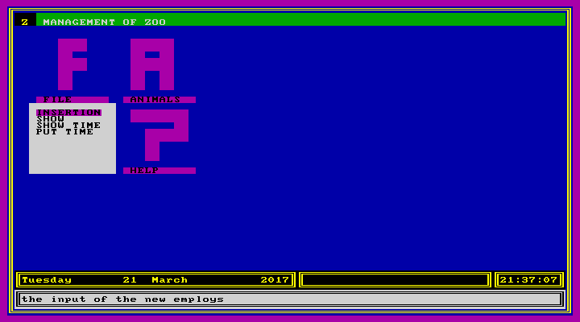
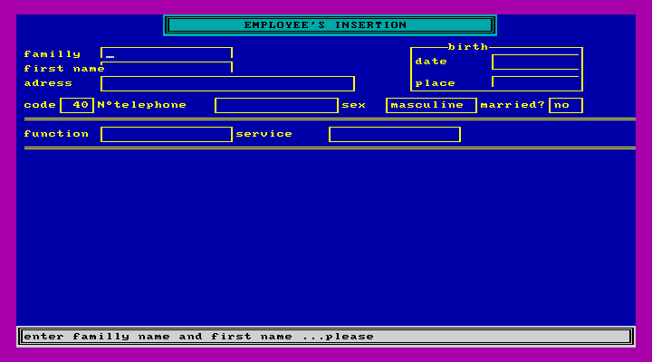
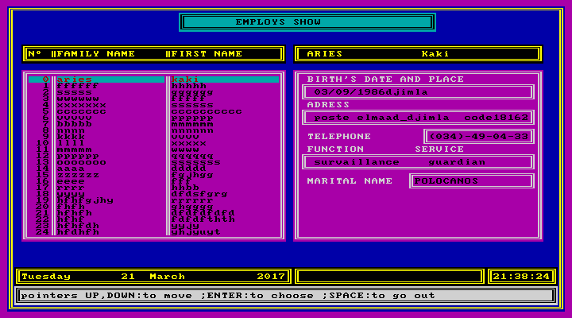
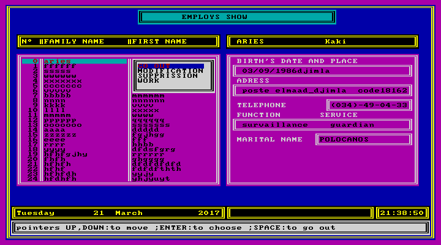
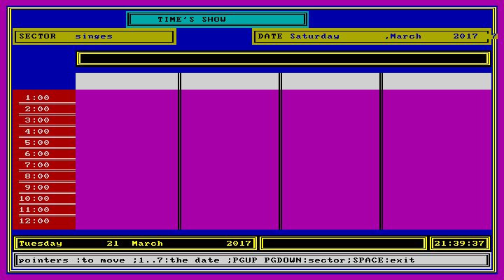

# TP1- Zoo management

## description
This second homework consists of designing a program to manage
a zoo:
* Workers management: add, modify, show, search and delete
  * Medical service: Veterinarians and vet-nurses
  * Surveillance service: guards and sector heads
  * Administrative service: secretaries, accountants, Chief staff and director
* Salary management: attribute, show the 12 last salaries, etc.
* Cages and work management:
  * There are sectors (birds, reptiles, etc.) having a sector head each. Each sector contains many cages.
  * The surveillance schedule for guards must be managed (each guard works in a sector by day, but change the cages)
* Animals management: Animals can be individuals or groups. For individuals some data must be preserved such as weight, parents, etc. For groups, we preserve the approximative number

|   Information  | |
|------------- | ------------- |
| Programming language  | Clipper  |
| Language  | French, English  |
| State  | Not finished  |
| Homework Returning  | Summer 2006  |

## How to?

* Install Winows XP on a virtual machine
* You can execute the program in "exe/", or
* Install Clipper ([Download](https://winworldpc.com/product/clipper/5x))
* Compile the program in "code/"

## Screenshots

### Functionalities

Main window

File menu

Icon style: a GUI style to back the menu one

about

Security

### employees management

Employees menu in Icon style

Employees Insertion

Employees Show

Functions on Employees

Employees schedule

### Animals management

Unfortunately, I didn't finish the homework. So, this section will be empty
