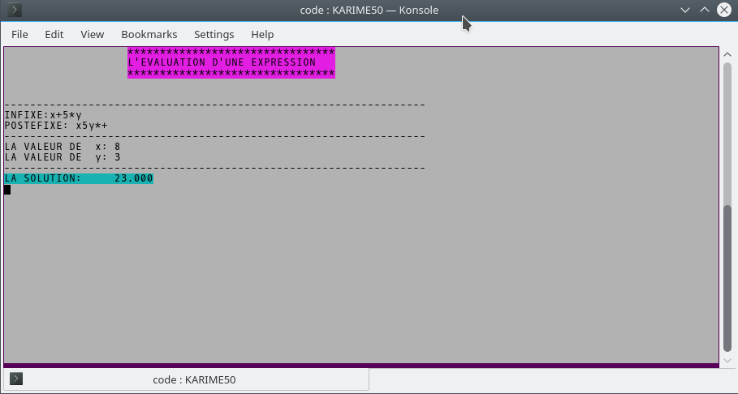

# TAD
In this folder a homework of algorithmic course.  

## Description

In this homework, the user enters an arithmetic expression such as:
```
x + 5 * y
```
* This expression will be put in a Queue (code/K_FIL.PAS)
* It will be, then, transformed to postfix annotation and stocked into a stack (code/K_PILE.PAS)
* For each variable, the user must insert a value
* The expression will be evaluated, and the result returned

## Try

You can try (exe/KARIME50.EXE) or compile it using Turbo Pascal.

It can be compiled on Linux using **fpc** and it works just fine

## Screenshot


