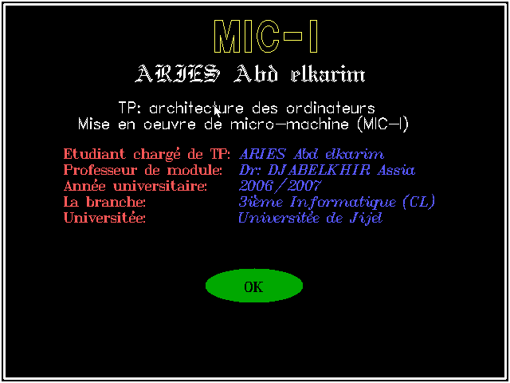
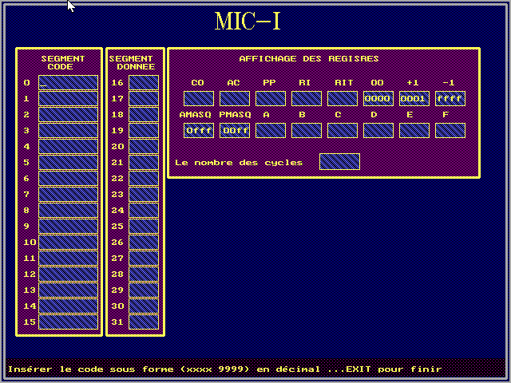
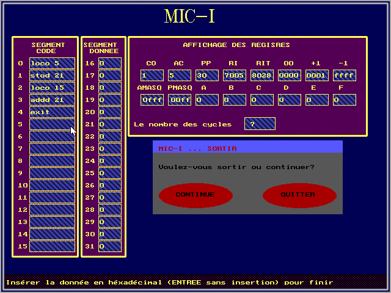
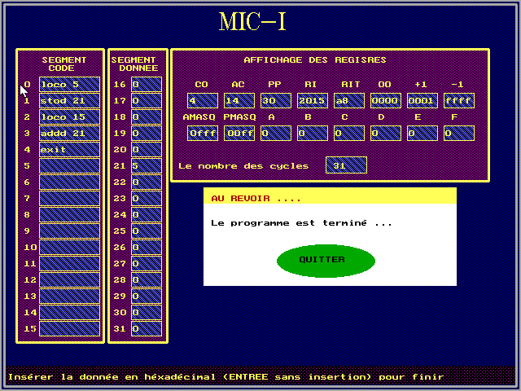

# TP1- MIC-1 Simulation

MIC-1 is a micro-programmed processor architecture proposed by Andrew S. Tanenbaum.

See more about it on [Wikipedia](https://en.wikipedia.org/wiki/MIC-1)

[Here](https://www.tjhsst.edu/~dhyatt/arch/mic1.html) and [here](http://www.cs.uml.edu/~bill/cs305/Mic1_Help_basics.pdf) some descriptions of its instructions

|   Information  | |
|------------- | ------------- |
| Programming language  | C  |
| Language  | French  |
| Project year  | 2006/2007  |

## Try it
* Install Winows XP on a virtual machine
* Execute "exe/K_MIC.EXE"; or
* Install Turbo C or C++
* Compile the code in "code/"

## Screenshots

Splash screen



Enter the code (MIC-1)



Entering this code
```
loco 5 //ac = 5.d
stod 21 //m[21] = ac
loco 15 //ac = 15.d
addd 21 // ac = ac + m[21]
exit // to end typing
```
Then in memory, push Enter (to not enter memory content)

With each instruction executed, it is asked if you want to continue



In the end:
* Memory 21 contains 5
* Accumulator ac contains 14.h (20.d = 5.d + 15.d)


