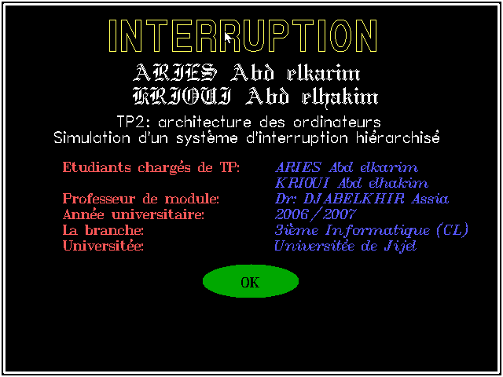
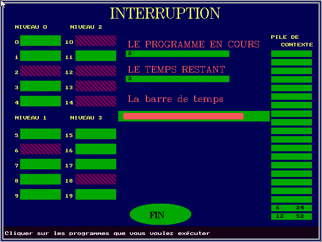

# TP2- Interruption Simulation

Assuming we have some processes where each has a level:
* We can choose the processes to execute any time
* the lesser the level is, the more priority it has
* If we choose a process with level less than the one's executing, the context will
be saved to memory and it will be recovered after that

|   Information  | |
|------------- | ------------- |
| Programming language  | C  |
| Language  | French  |
| Project year  | 2006/2007  |
| Project by | Abdelkrime Aries (me)|
|  | Abdelhakim Krioui|

## Try it
* Install Winows XP on a virtual machine
* Execute "exe/TP2_ARCH.EXE"; or
* Install Turbo C or C++
* Compile the code in "code/"

## Screenshots

Splash screen

The program functionning

