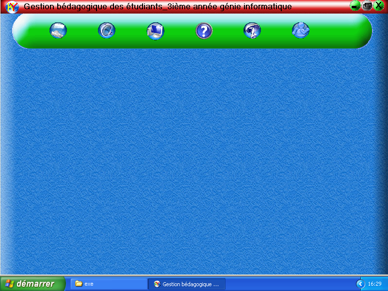
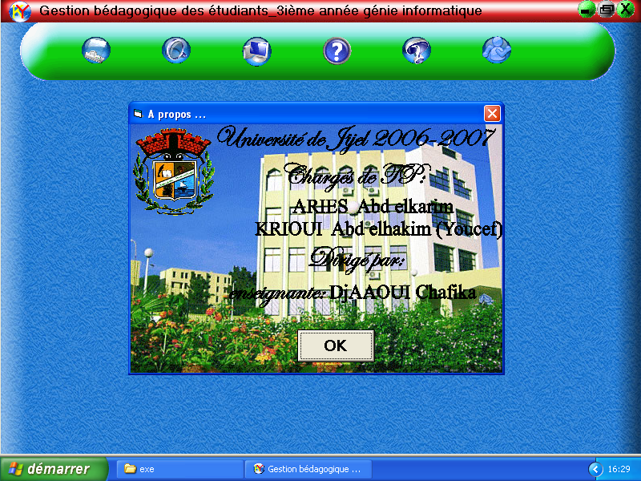
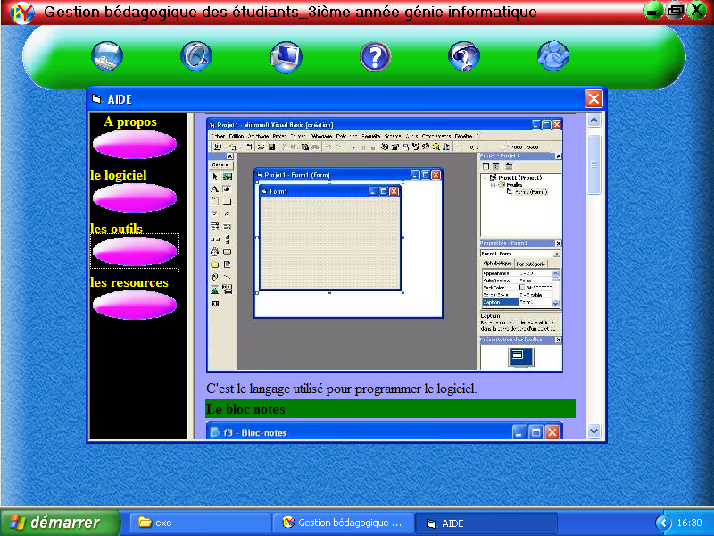
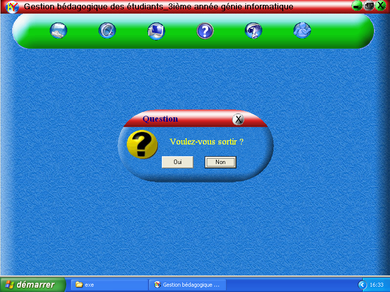
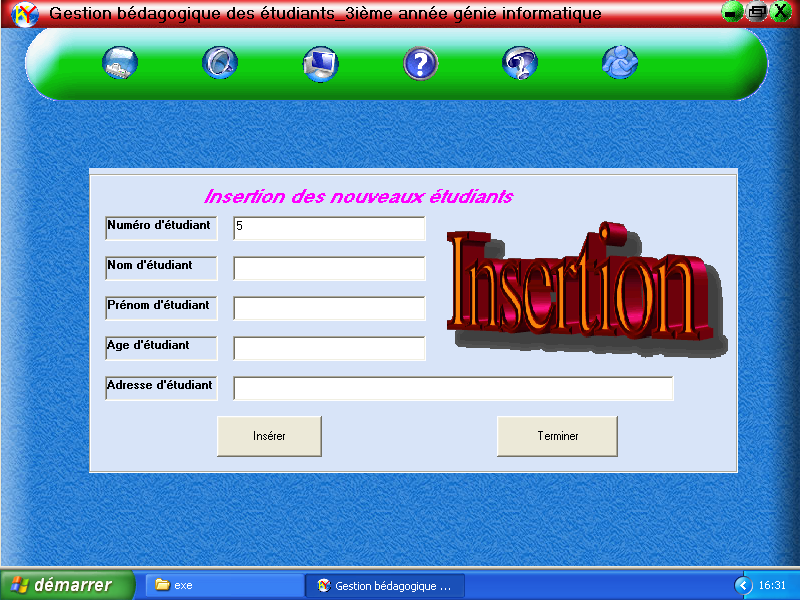
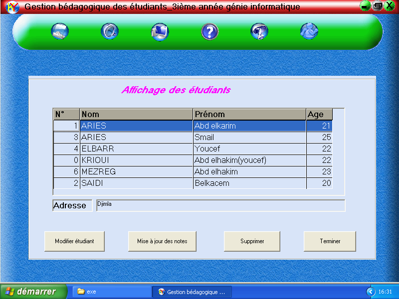
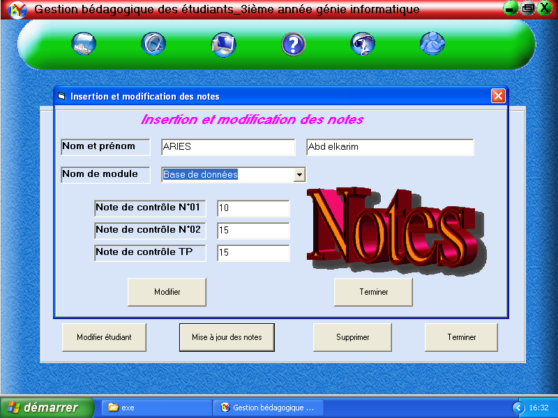
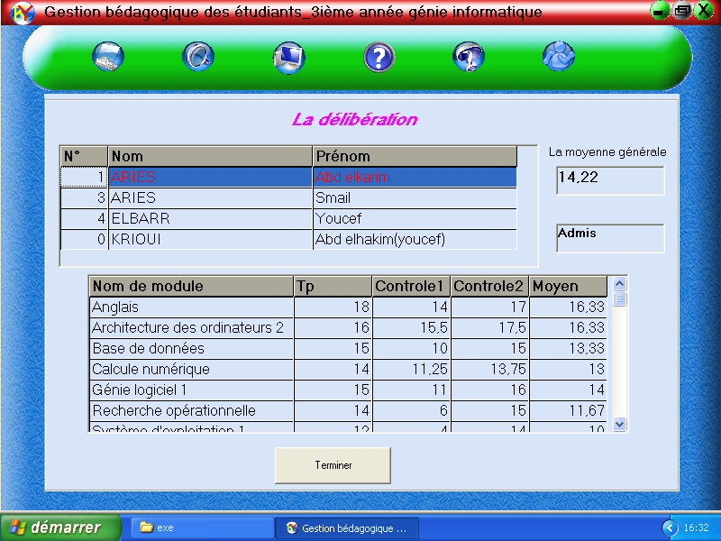

# BD
In this folder the homework of databases course

## Description

A program to manage students and their marks. It have to use SQL language which is the focus of
this homework.

|   Information  | |
|------------- | ------------- |
| Programming language  | VB6  |
| Language  | French  |
| Project year  | 2006/2007  |
| Project by | Abdelkrime Aries (me)|
|  | Abdelhakim Krioui|

## Try it
* Download "VB6FR.dll" and put it in "system32" (Windows XP 32 bits)
* Execute "exe/BDTP.exe"

To compile it, install "**visual basic 6**"

## Screenshots

Main Window

About Window

Help Window

Exit

New student

Show and manage students

Modify marks

Deliberation Window

