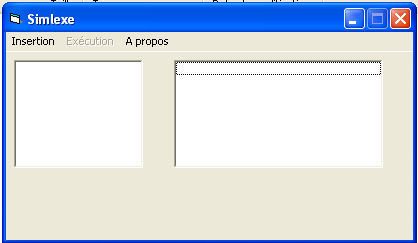
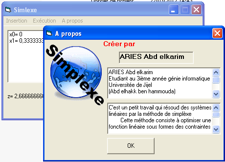
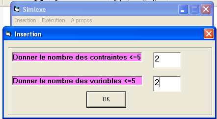
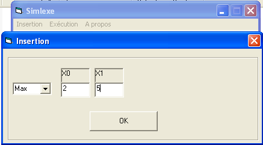
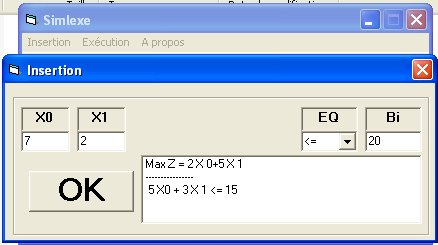
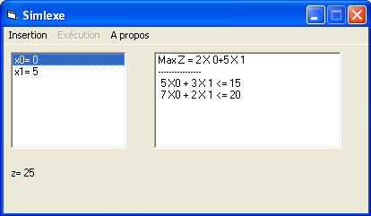

# RO
In this folder the homework of Operations research course

## Description

[Simplex algorithm](https://en.wikipedia.org/wiki/Simplex_algorithm) realization

|   Information  | |
|------------- | ------------- |
| Programming language  | VB6  |
| Language  | French  |
| Project year  | 2006/2007  |
| Project by | Abdelkrime Aries|
| State | Fails |

I think I got a zero on it, since it failed with the two examples afforded

## Try it
* Download "VB6FR.dll" and put it in "system32" (Windows XP 32 bits)
* Execute "simplexe.exe"

To compile it, install "**visual basic 6**"

## Screenshots

Main Window

About Window

Defining the number of constraints and variables

The objective function: Maximize or minimize

Introduce the constraints

Result

