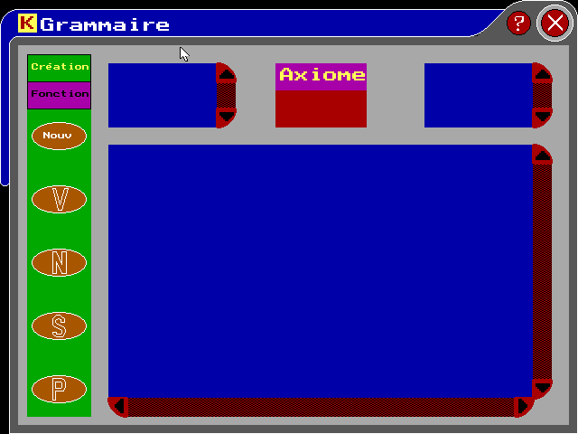
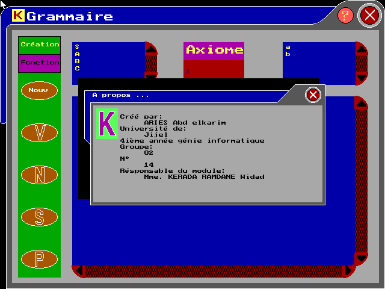
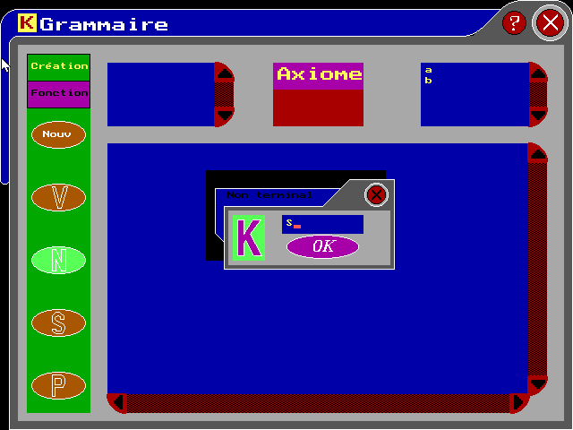
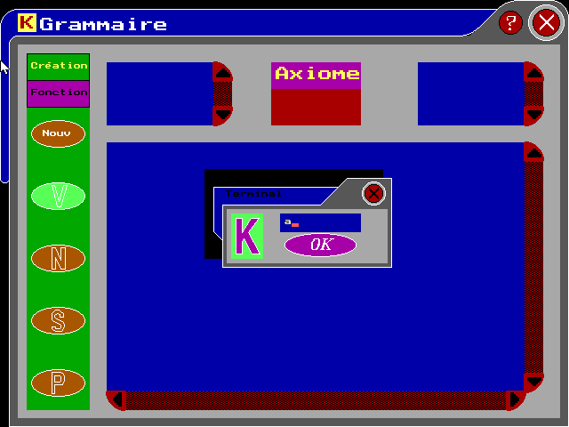
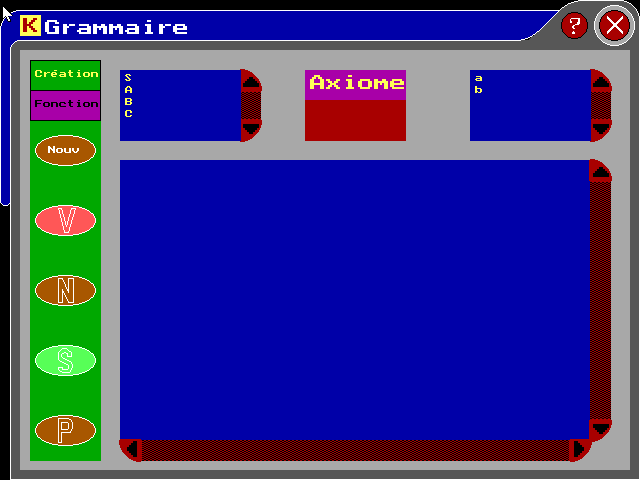
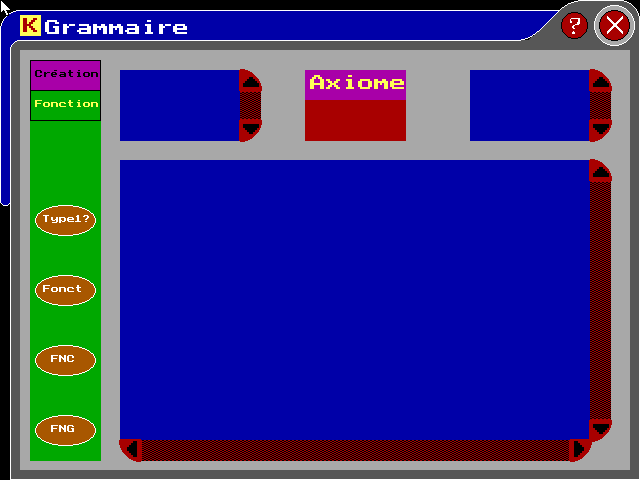

# COMP

This is the homework of compilation course; It consists two parts

## Part1: Grammars
The program must afford a mechanism to introduce terminals, non terminals, axiom and production rules.
After that, it must afford these functions:
* Test if the language is type 2 (context free)
* Simplify the grammar
* Transform the Grammar to Greibach normal form
* Transform the Grammar to Chomsky normal form

|   Information  | |
|------------- | ------------- |
| Programming language  | Turbo Pascal  |
| Language  | French  |
| Year | 2007-2008  |

### How to?
* Install Winows XP on a virtual machine
* Install Turbo Pascal
* Compile the Project
* Copy the BGI files to the executable folder

You will be facing many problems due to the CPU speed.
The program uses delays which are designed for old computers.
Even with the patch afforded for Pascal, the problem of mouse click remains.
Trying to use fpc is worse

### Screenshots

These are some Screenshots; since there were problems using the program on new PCs, these are the
Screenshots I could capture.

The main window



About



Non terminals



Terminals



Axiom



Functions




## Part2: A compiler

### Propose a grammar for a language
This is te language I prposed in BNF
```
01) PROG ::= algorithme IDENT \n BLOC
02) IDENT ::= LETTRE {CAR}
03) BLOC ::= DECL  debut  \n {INST} fin
04) LETTRE ::= a |…| z | A | … | Z
05) CAR ::= LETTRE | CHIFFRE
06) DECL ::= [CONST][VAR][PROC]
07) INST ::= SIMPLE | COMPOSE
08) CHIFFRE ::= 0 |...| 9
09) CONST ::= const \n CNST {CNST}
10) CNST::= IDENT :  IDCONST  \n
11) VAR::= def  \n  SUITVAR  \n  {SUITVAR \n }
12) PROC::= proc IDENT [( PARAM{;PARAM} ) ] \n BLOC \n
13) SIMPLE ::= LECT|ECR|AFF|CALLPROC
14) COMPOSE ::= IF|WHILE|FOR
15) IDCONST::= NOMBRE | ’CAR{CAR}’ | vrai | faux
16) SUITVAR ::= IDENT{,IDENT} comme TYPE
17) PARAM ::= [@] SUITVAR
18) LECT ::= lire ( IDENT{,IDENT} ) [lig] \n
19) ECR ::= ecrire ( IDENT{,IDENT}) [lig] \n
20) AFF ::= IDENT = EXPR \n
21) CALLPROC ::= IDENT [( IDENT{,IDENT})] \n
22) IF ::= si COND alors \n {SIMPLE} [ sinon \n {SIMPLE}] fsi \n
23) WHILE ::= tq COND faire \n {SIMPLE} ftq \n
24) FOR ::= pour AFF vers ARITH faire \n {SIMPLE} fpour \n
25) TYPE ::= ent | reel | car | log | tab ( NBR )
26) EXPR ::= ARITH | LOGI
27) COND ::= CND [{( et | ou  ) CND} ]
28) NOMBRE ::= [ + | - ] CHIFFRE {CHIFFRE} [.{CHIFFRE}]
29) ARITH ::= MULT {( + | - ) MULT}
30) CND ::= ( ARITH  OPER  ARITH ) | ( LOGI [ ( = | <> ) LOGI ] )
31) LOGI::= ET { ou ET}
32) MULT::= OPDA { ( * | div | / ) OPDA }
33) ET::= OPDB { et OPDB}
34) OPER::=   = | <> | < | > | <= | >=
35) OPDA::= NOMBRE | IDENT | ( ARITH )
36) OPDB::= [non ] ( LOGI ) | vrai | faux | [ non ] IDENT
```
